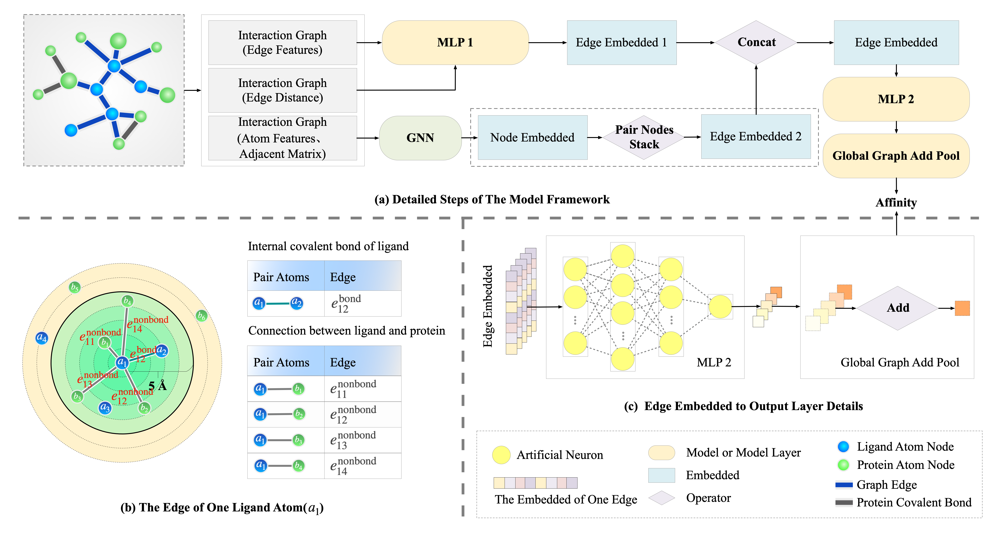

## SS-GNN

> This is a Pytorch implementation of `SS-GNN`, a simple-structured GNN model for drug-target binding affinity (DTBA) prediction as described in the following paper:

The `SS-GNN` defines the prediction of DTBA as a regression task, in which the model’s input is the drug-target representation, and the output is a continuous value representing the binding affinity score between the drug and the target protein. The overall architecture of the `SS-GNN` is shown in the figure below.

## Get Started

1. Setup

    Necessary packages should be installed to run the SS-GNN model.
    Dependecies: 
    * python >= 3.7
    * Pytorch (>=1.6.0),
    * numpy,
    * scipy,
    * scikit-learn.

2. Datasets
   
    We adopt the PDBbind dataset v2019 for experiments and employ two test sets (the v2016 and v2013 core sets) to test the performance of SS-GNN.
3. Train the model

    Use the `train.py` script to train the model. 

## Citation

When using this project in your research, please cite:
<section id="citation">
  <blockquote>
    Zhang, S., Jin, Y., Liu, T., Wang, Q., Zhang, Z., Zhao, S., & Shan, B. (2023). 
    <strong>SS-GNN: A Simple-Structured Graph Neural Network for Affinity Prediction.</strong> 
    <i>ACS Omega</i>, 8(25), 22496–22507. 
    <a href="https://doi.org/10.1021/acsomega.3c00085">https://doi.org/10.1021/acsomega.3c00085</a>
  </blockquote>
</section>
